Linear Regression Mini-Competition
================

``` r
library(tidyverse)
library(tidymodels)
library(ggplot2)
library(yardstick)
library(ggplot2)
```

``` r
news_data <- readr::read_csv("~/STA 631/Mini-Competition/data/news.csv")
```

    ## Rows: 92431 Columns: 11
    ## ── Column specification ────────────────────────────────────────────────────────
    ## Delimiter: ","
    ## chr (5): Title, Headline, Source, Topic, PublishDate
    ## dbl (6): IDLink, SentimentTitle, SentimentHeadline, Facebook, GooglePlus, Li...
    ## 
    ## ℹ Use `spec()` to retrieve the full column specification for this data.
    ## ℹ Specify the column types or set `show_col_types = FALSE` to quiet this message.

``` r
# Get the number of rows and columns of the dataset
num_rows <- nrow(news_data)
num_cols <- ncol(news_data)
print(paste("Number of Rows:", num_rows))
```

    ## [1] "Number of Rows: 92431"

``` r
print(paste("Number of Columns:", num_cols))
```

    ## [1] "Number of Columns: 11"

``` r
# Check for missing values in the dataset
missing_values <- sum(is.na(news_data))
print(paste("Number of Missing Values:", missing_values))
```

    ## [1] "Number of Missing Values: 358"

``` r
# Remove rows with missing values
news1_data <- na.omit(news_data)

# Print the dimensions of the cleaned dataset
clean_dimensions <- dim(news1_data)
print(paste("Dimensions of Cleaned Dataset (rows, columns):", clean_dimensions))
```

    ## [1] "Dimensions of Cleaned Dataset (rows, columns): 92073"
    ## [2] "Dimensions of Cleaned Dataset (rows, columns): 11"

``` r
# Identify numeric columns
numeric_columns <- sapply(news1_data, is.numeric)

# Identify categorical columns
categorical_columns <- sapply(news1_data, function(x) !is.numeric(x))

# Calculate the number of unique values in each numeric column
unique_counts_numeric <- sapply(news1_data[, numeric_columns], function(x) length(unique(x)))

# Calculate the number of unique values in each categorical column
unique_counts_categorical <- sapply(news1_data[, categorical_columns], function(x) length(unique(x)))

# Print the total number of unique values for each numeric column
print("Total number of unique values in each numeric column:")
```

    ## [1] "Total number of unique values in each numeric column:"

``` r
print(unique_counts_numeric)
```

    ##            IDLink    SentimentTitle SentimentHeadline          Facebook 
    ##             92073             13239             38962              2528 
    ##        GooglePlus          LinkedIn 
    ##               292               845

``` r
# Print the total number of unique values for each categorical column
print("\nTotal number of unique values in each categorical column:")
```

    ## [1] "\nTotal number of unique values in each categorical column:"

``` r
print(unique_counts_categorical)
```

    ##       Title    Headline      Source       Topic PublishDate 
    ##       80329       85683        5734           4       64022

The following columns cannot be explored further because they have too
many unique values:- IDLink, Title, Headline, Source and PublishDate.

``` r
library(ggplot2)
# Plot the distribution of the "Topic" column
ggplot(news1_data, aes(x = Topic)) +
  geom_bar(fill = "skyblue", color = "blue") +
  labs(title = "Distribution of Topic", x = "Topic", y = "Frequency") +
  theme(axis.text.x = element_text(angle = 45, hjust = 1))
```

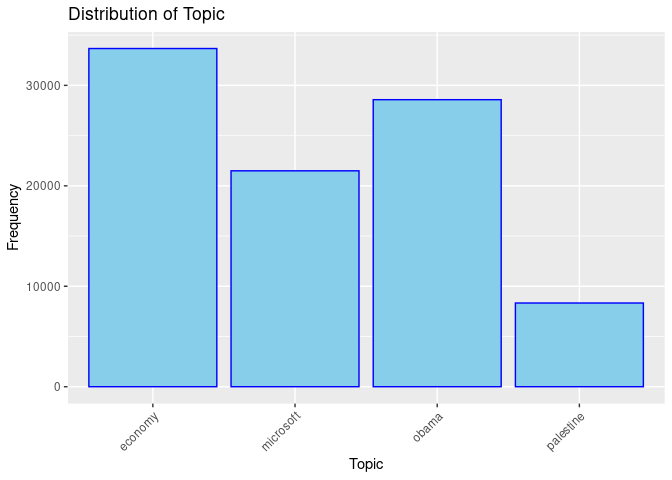<!-- -->

``` r
library(ggplot2)

# Specify the columns for box plots
columns <- c("SentimentTitle", "SentimentHeadline", "Facebook", "GooglePlus", "LinkedIn")

# Reshape the data for plotting
news1_data_long <- tidyr::pivot_longer(news1_data, cols = columns, names_to = "Variable", values_to = "Value")
```

    ## Warning: Using an external vector in selections was deprecated in tidyselect 1.1.0.
    ## ℹ Please use `all_of()` or `any_of()` instead.
    ##   # Was:
    ##   data %>% select(columns)
    ## 
    ##   # Now:
    ##   data %>% select(all_of(columns))
    ## 
    ## See <https://tidyselect.r-lib.org/reference/faq-external-vector.html>.
    ## This warning is displayed once every 8 hours.
    ## Call `lifecycle::last_lifecycle_warnings()` to see where this warning was
    ## generated.

``` r
# Create box plots
ggplot(news1_data_long, aes(x = Variable, y = Value)) +
  geom_boxplot(fill = "skyblue", color = "blue") +
  labs(title = "Box Plots of SentimentTitle, SentimentHeadline, Facebook, GooglePlus, and LinkedIn",
       x = "Variable", y = "Value") +
  theme(axis.text.x = element_text(angle = 45, hjust = 1)) +
  facet_wrap(~Variable, scales = "free")
```

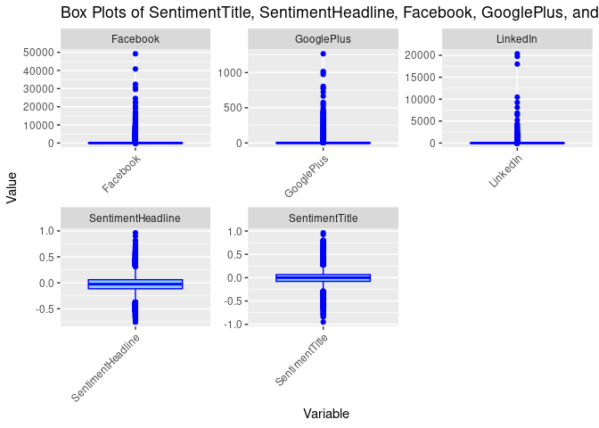<!-- -->

There are outliers in the dataset.

``` r
# Function to identify and remove outliers from a numeric column
remove_outliers_from_column <- function(column) {
  Q1 <- quantile(column, 0.25)
  Q3 <- quantile(column, 0.75)
  IQR <- Q3 - Q1
  lower_threshold <- Q1 - 1.5 * IQR
  upper_threshold <- Q3 + 1.5 * IQR
  column[!(column < lower_threshold | column > upper_threshold)]
}

# Identify outliers in the "LinkedIn" column
linkedin_outliers <- which(news1_data$LinkedIn < quantile(news1_data$LinkedIn, 0.25) - 1.5 * IQR(news1_data$LinkedIn) |
                           news1_data$LinkedIn > quantile(news1_data$LinkedIn, 0.75) + 1.5 * IQR(news1_data$LinkedIn))

# Remove rows with outliers in the "LinkedIn" column
news1_data <- news1_data[-linkedin_outliers, ]

# Print dimensions after removing rows with outliers in the "LinkedIn" column
print("Dimensions after removing rows with outliers in the LinkedIn column:")
```

    ## [1] "Dimensions after removing rows with outliers in the LinkedIn column:"

``` r
print(dim(news1_data))
```

    ## [1] 76974    11

``` r
library(ggplot2)

# Specify the columns for box plots
columns <- c("SentimentTitle", "SentimentHeadline", "Facebook", "GooglePlus", "LinkedIn")

# Reshape the data for plotting
news1_data_long <- tidyr::pivot_longer(news1_data, cols = columns, names_to = "Variable", values_to = "Value")

# Create box plots
ggplot(news1_data_long, aes(x = Variable, y = Value)) +
  geom_boxplot(fill = "skyblue", color = "blue") +
  labs(title = "Box Plots of SentimentTitle, SentimentHeadline, Facebook, GooglePlus, and LinkedIn",
       x = "Variable", y = "Value") +
  theme(axis.text.x = element_text(angle = 45, hjust = 1)) +
  facet_wrap(~Variable, scales = "free")
```

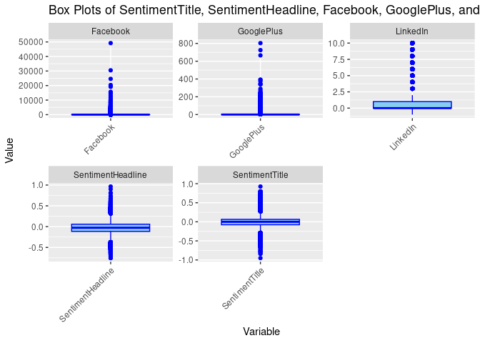<!-- -->

``` r
# Function to identify and remove outliers from a numeric column
remove_outliers_from_column <- function(column) {
  Q1 <- quantile(column, 0.25)
  Q3 <- quantile(column, 0.75)
  IQR <- Q3 - Q1
  lower_threshold <- Q1 - 1.5 * IQR
  upper_threshold <- Q3 + 1.5 * IQR
  column[!(column < lower_threshold | column > upper_threshold)]
}

# Identify outliers in the "GooglePlus" column
googleplus_outliers <- which(news1_data$GooglePlus < quantile(news1_data$GooglePlus, 0.25) - 1.5 * IQR(news1_data$GooglePlus) |
                           news1_data$GooglePlus > quantile(news1_data$GooglePlus, 0.75) + 1.5 * IQR(news1_data$GooglePlus))

# Remove rows with outliers in the "GooglePlus" column
news1_data <- news1_data[-googleplus_outliers, ]

# Print dimensions after removing rows with outliers in the "GooglePlus" column
print("Dimensions after removing rows with outliers in the GooglePlus column:")
```

    ## [1] "Dimensions after removing rows with outliers in the GooglePlus column:"

``` r
print(dim(news1_data))
```

    ## [1] 65696    11

``` r
library(ggplot2)

# Specify the columns for box plots
columns <- c("SentimentTitle", "SentimentHeadline", "Facebook", "GooglePlus", "LinkedIn")

# Reshape the data for plotting
news1_data_long <- tidyr::pivot_longer(news1_data, cols = columns, names_to = "Variable", values_to = "Value")

# Create box plots
ggplot(news1_data_long, aes(x = Variable, y = Value)) +
  geom_boxplot(fill = "skyblue", color = "blue") +
  labs(title = "Box Plots of SentimentTitle, SentimentHeadline, Facebook, GooglePlus, and LinkedIn",
       x = "Variable", y = "Value") +
  theme(axis.text.x = element_text(angle = 45, hjust = 1)) +
  facet_wrap(~Variable, scales = "free")
```

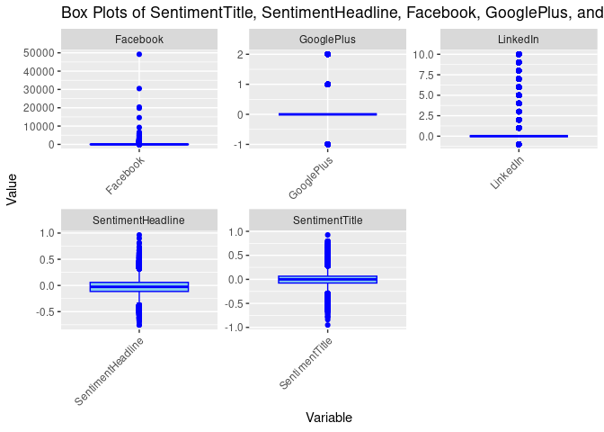<!-- -->

``` r
# Function to identify and remove outliers from a numeric column
remove_outliers_from_column <- function(column) {
  Q1 <- quantile(column, 0.25)
  Q3 <- quantile(column, 0.75)
  IQR <- Q3 - Q1
  lower_threshold <- Q1 - 1.5 * IQR
  upper_threshold <- Q3 + 1.5 * IQR
  column[!(column < lower_threshold | column > upper_threshold)]
}

# Identify outliers in the "Facebook" column
facebook_outliers <- which(news1_data$Facebook < quantile(news1_data$Facebook, 0.25) - 1.5 * IQR(news1_data$Facebook) |
                           news1_data$Facebook > quantile(news1_data$Facebook, 0.75) + 1.5 * IQR(news1_data$Facebook))

# Remove rows with outliers in the "Facebook" column
news1_data <- news1_data[-facebook_outliers, ]

# Print dimensions after removing rows with outliers in the "Facebook" column
print("Dimensions after removing rows with outliers in the Facebook column:")
```

    ## [1] "Dimensions after removing rows with outliers in the Facebook column:"

``` r
print(dim(news1_data))
```

    ## [1] 56373    11

``` r
library(ggplot2)

# Specify the columns for box plots
columns <- c("SentimentTitle", "SentimentHeadline", "Facebook", "GooglePlus", "LinkedIn")

# Reshape the data for plotting
news1_data_long <- tidyr::pivot_longer(news1_data, cols = columns, names_to = "Variable", values_to = "Value")

# Create box plots
ggplot(news1_data_long, aes(x = Variable, y = Value)) +
  geom_boxplot(fill = "skyblue", color = "blue") +
  labs(title = "Box Plots of SentimentTitle, SentimentHeadline, Facebook, GooglePlus, and LinkedIn",
       x = "Variable", y = "Value") +
  theme(axis.text.x = element_text(angle = 45, hjust = 1)) +
  facet_wrap(~Variable, scales = "free")
```

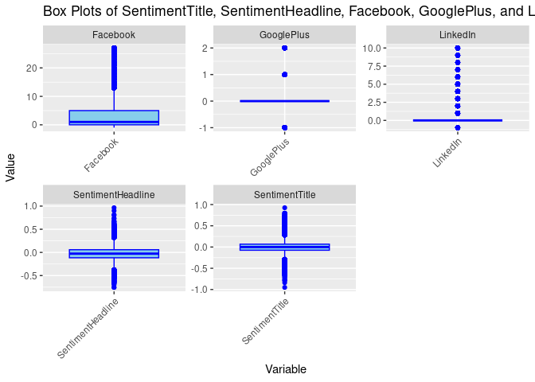<!-- -->

``` r
# Select numeric columns
numeric_columns <- sapply(news1_data, is.numeric)
numeric_data <- news1_data[, numeric_columns]

# Calculate correlation matrix
correlation_matrix <- cor(numeric_data)

# Print correlation matrix
print("Correlation Matrix:")
```

    ## [1] "Correlation Matrix:"

``` r
print(correlation_matrix)
```

    ##                         IDLink SentimentTitle SentimentHeadline    Facebook
    ## IDLink             1.000000000    0.005835097        0.02473382  0.07394195
    ## SentimentTitle     0.005835097    1.000000000        0.19668528 -0.01007670
    ## SentimentHeadline  0.024733815    0.196685275        1.00000000  0.01430952
    ## Facebook           0.073941949   -0.010076701        0.01430952  1.00000000
    ## GooglePlus        -0.091078375    0.009175863        0.02043585  0.34126663
    ## LinkedIn          -0.161731478    0.006689204        0.01599211  0.23953784
    ##                     GooglePlus     LinkedIn
    ## IDLink            -0.091078375 -0.161731478
    ## SentimentTitle     0.009175863  0.006689204
    ## SentimentHeadline  0.020435850  0.015992111
    ## Facebook           0.341266626  0.239537845
    ## GooglePlus         1.000000000  0.329143432
    ## LinkedIn           0.329143432  1.000000000

No multicolliearity

``` r
# Load necessary library
library(ggplot2)

# Create histogram for SentimentHeadline
ggplot(news1_data, aes(x = SentimentHeadline)) +
  geom_histogram(binwidth = 1, fill = "skyblue", color = "black") +
  labs(title = "Distribution of SentimentHeadline",
       x = "SentimentHeadline",
       y = "Frequency")
```

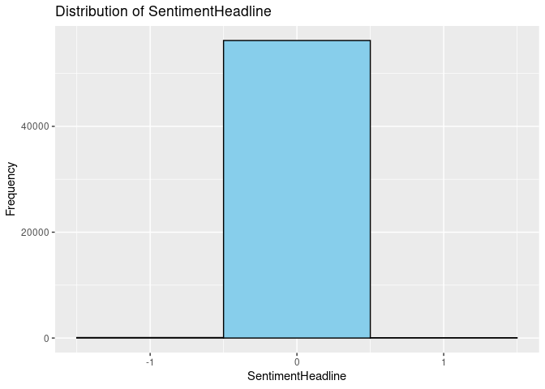<!-- -->

``` r
# Calculate correlation coefficients between "SentimentHeadline" and other numeric variables
correlation_sentiment_headline <- cor(news1_data$SentimentHeadline, news1_data[sapply(news1_data, is.numeric)])

# Print correlation coefficients
print("Correlation between SentimentHeadline and other numeric variables:")
```

    ## [1] "Correlation between SentimentHeadline and other numeric variables:"

``` r
print(correlation_sentiment_headline)
```

    ##          IDLink SentimentTitle SentimentHeadline   Facebook GooglePlus
    ## [1,] 0.02473382      0.1966853                 1 0.01430952 0.02043585
    ##        LinkedIn
    ## [1,] 0.01599211

Presence of weak correlations.

``` r
# Load necessary library
library(ggplot2)

# Create scatter plots for SentimentHeadline against each numeric variable
scatter_plots <- lapply(names(news1_data)[sapply(news1_data, is.numeric)], function(var) {
  ggplot(news1_data, aes(x = SentimentHeadline, y = .data[[var]])) +
    geom_point() +
    labs(title = paste("Scatter Plot of SentimentHeadline vs", var),
         x = "SentimentHeadline", y = var)
})

# Print scatter plots
scatter_plots
```

    ## [[1]]

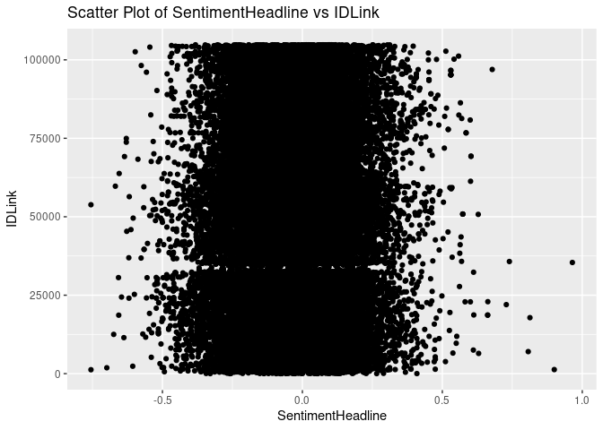<!-- -->

    ## 
    ## [[2]]

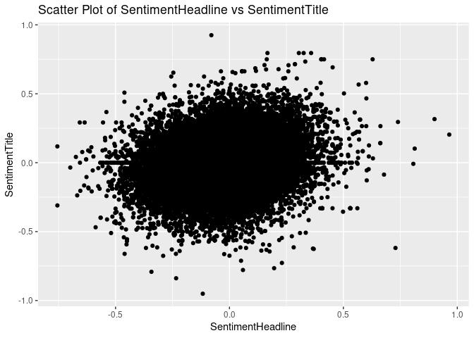<!-- -->

    ## 
    ## [[3]]

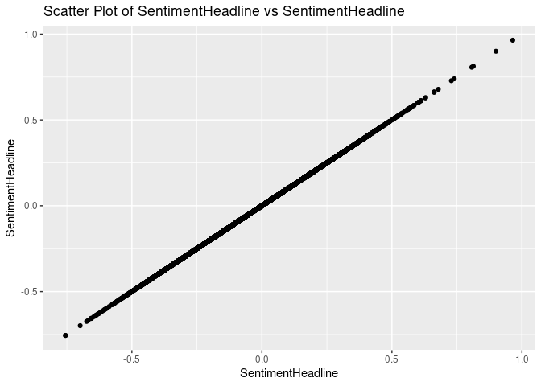<!-- -->

    ## 
    ## [[4]]

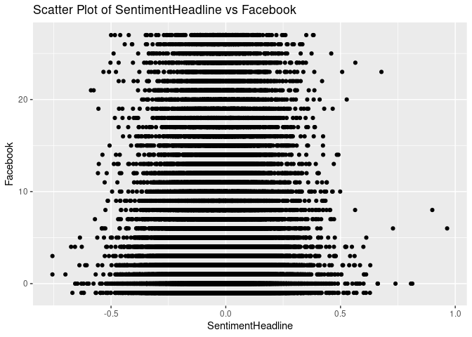<!-- -->

    ## 
    ## [[5]]

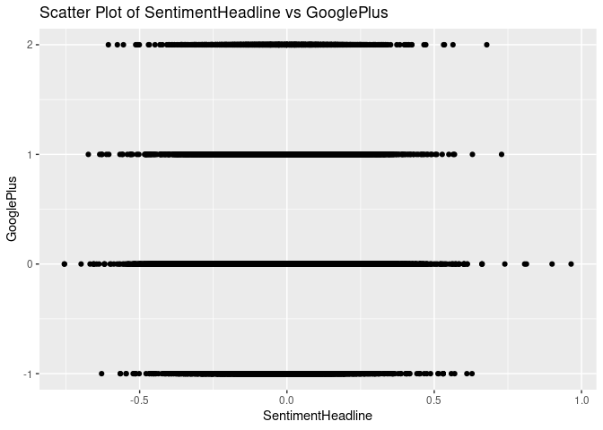<!-- -->

    ## 
    ## [[6]]

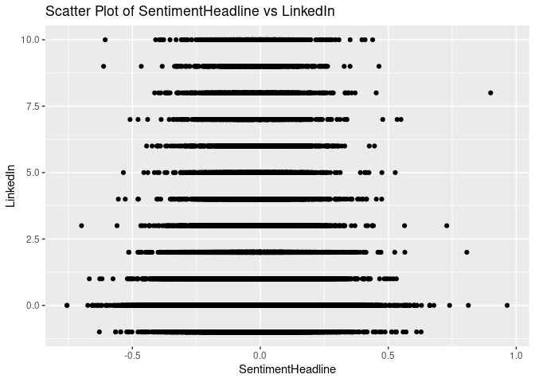<!-- -->

Variable selection;- We eliminated the the following variables since
they have too many unique values hence model cannot learn anything from
them:- IDLink, Title, Headline, Source and PublishDate.
